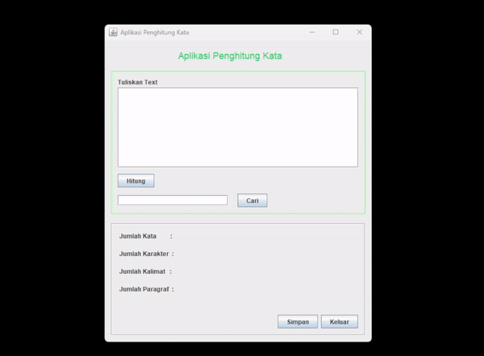

# Aplikasi Penghitung Kata

*Aplikasi Penghitung Kata* adalah aplikasi berbasis Java Swing yang memungkinkan pengguna untuk menganalisis teks dengan menghitung jumlah kata, karakter, kalimat, dan paragraf. Aplikasi ini juga memiliki fitur pencarian kata dalam teks dan dapat menyimpan hasil perhitungan ke dalam file teks.

## Fitur Utama

1. **Penghitungan Secara Real Time**:
   - Menghitung jumlah kata, karakter , kalimat, dan paragraf dalam teks yang dimasukkan pengguna.
2. **Pencarian Kata**:
   - Fitur pencarian kata yang menyorot semua kemunculan kata yang dicari di dalam teks dengan warna kuning.
   - Menampilkan jumlah kemunculan kata yang ditemukan.
3. **Simpan Hasil Perhitungan**:
   - Hasil perhitungan dapat disimpan ke dalam file teks (`hasil_perhitungan.txt`).
4. **Antarmuka Pengguna yang Intuitif**:
   - Menggunakan komponen Java Swing dengan desain yang mudah dipahami.

## Cara Menggunakan Aplikasi

1. Masukkan teks pada area teks yang disediakan.
2. Klik tombol **Hitung** untuk mendapatkan jumlah kata, karakter, kalimat, dan paragraf.
3. Untuk mencari kata dalam teks, masukkan kata yang dicari pada kolom pencarian, kemudian klik tombol **Cari**. Semua kemunculan kata tersebut akan disorot dengan warna kuning.
4. Klik tombol **Simpan** untuk menyimpan teks dan hasil perhitungan ke dalam file `hasil_perhitungan.txt`.

## Struktur Kode

- **PenghitungKataFrame.java**: File utama yang berisi logika aplikasi dan antarmuka pengguna.
- **Fitur Utama**:
  - `hitungKata()`: Menghitung jumlah kata, karakter, kalimat, dan paragraf.
  - `jButton2ActionPerformed()`: Mengimplementasikan pencarian kata dan menyorot hasilnya.
  - `jButton3ActionPerformed()`: Menyimpan teks dan hasil perhitungan ke file teks.

## Prasyarat

- Java Development Kit (JDK) 8 atau versi lebih baru.
- IDE seperti NetBeans atau IntelliJ IDEA untuk menjalankan proyek.

## DEMO

